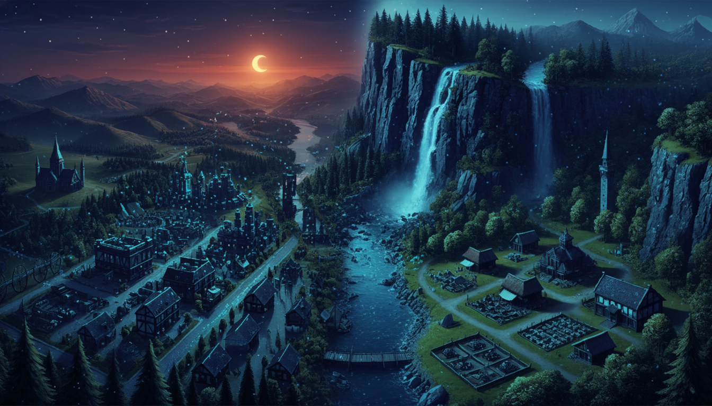
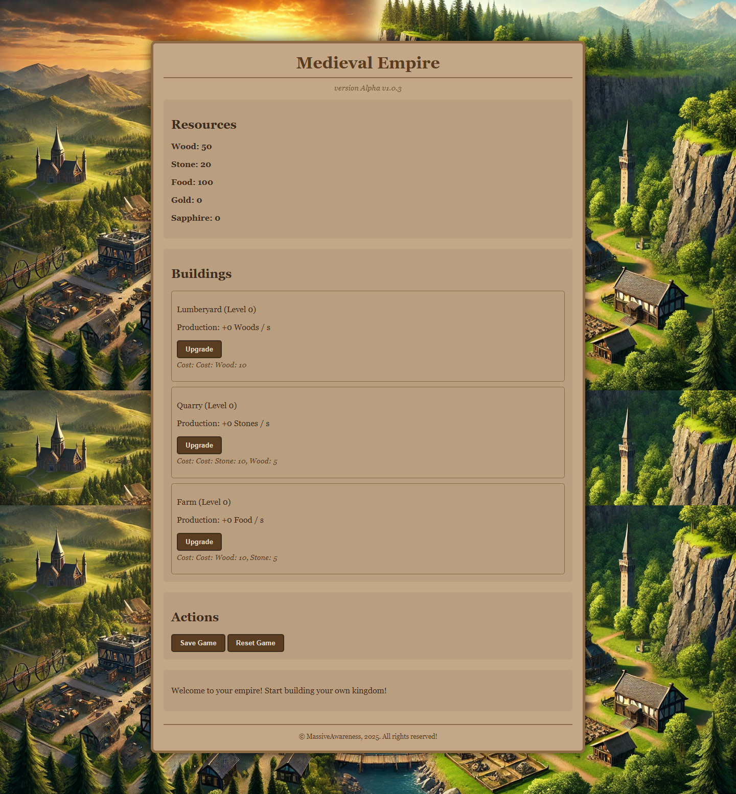

# Medieval Empire

<div align="center">
  
</div>

**Alpha v1.2.1**

---

<div align="center">

A text-based empire-building and management game crafted with pure, vanilla HTML, CSS, and JavaScript (ES6 Modules).

</div>

<div align="center">
  
</div>

## Table of Contents

- [About The Game](#about-the-game)
- [Current Features](#current-features)
- [How To Play](#how-to-play)
- [Tech Stack](#tech-stack)
- [Project Structure](#project-structure)
- [Installation & Usage](#installation--usage)
- [Development Roadmap](#development-roadmap)
- [Contributing](#contributing)
- [Author](#author)

## About The Game

**Medieval Empire** is an incremental, text-based base-building game where you start as the lord of a humble settlement. Your goal is to manage resources, upgrade buildings, and make strategic decisions to grow your settlement into a thriving and feared empire. The game evokes the spirit of classic browser-based strategy games, implemented with modern web technologies and running entirely on the client-side.

## Current Features

- **Resource Management:** Automatically gather Wood, Stone, and Food from your production buildings.
- **Building & Upgrading:** Construct and upgrade three core buildings: the Lumberyard, the Quarry, and the Farm.
- **Real-Time Progression:** The game "lives" in the background thanks to a game loop that ticks every second, updating resources and construction timers.
- **Time-Based Construction:** Upgrading buildings takes time. With only a single construction queue, strategic planning is essential.
- **Persistent State:** All progress is automatically saved to the browser's `localStorage`. You can close your browser and resume your game later. Includes options to manually save and reset your game state.
- **Modular Codebase:** The JavaScript is organized into logical, separate modules (`state`, `ui`, `gameLogic`, `main`), making the code clean, maintainable, and easy to extend.
- **Polished UI:** A custom, atmospheric user interface featuring a loading screen with a progress bar and a hidden scrollbar for a more immersive experience.

## How To Play

1.  **Monitor Your Resources:** The Lumberyard generates Wood, the Quarry generates Stone, and the Farm generates Food. Production is passive and scales with the building's level.
2.  **Upgrade Your Buildings:** Click the "Upgrade" button on a building panel to start the construction process. You must have enough resources to afford the upgrade.
3.  **Plan Ahead:** You only have one builder! While one upgrade is in progress, you cannot start another. Plan which building is most critical for your strategy.
4.  **Save Your Progress:** While the game saves progress periodically, you can use the "Save Game" button to ensure your state is stored. To start over from scratch, use the "Reset Game" button.

## Tech Stack

This project is proudly built on the fundamental building blocks of the web, without any external JavaScript frameworks.

- **HTML5:** Provides the structure and content of the game.
- **CSS3:** Used for all visual styling, creating the medieval atmosphere, layout, and animations.
- **JavaScript (ES6+):** The engine for all game logic. It leverages ES6 Modules for a clean and organized codebase.

## Project Structure

The project follows a logical folder structure for easy navigation and maintenance.

```graphql
/MedievalEmpire/
|
|-- index.html # The main HTML file, the "skeleton" of the game
|-- style.css # All CSS styles in a single file
|-- README.md # This documentation file
|
|-- /images/
| |-- background.png # The main background image for the game
| |-- screenshot.png # The screenshot used above
| |-- favicon.ico # Favicon of the website
|
|-- /js/
|-- gameloop.js # MAIN ENTRY POINT: Manages the loading screen, initializes the game, and sets up event listeners
|-- state.js # The central brain of the game, contains the gameState object
|-- ui.js # Handles all DOM manipulation (updating the UI, displaying messages)
|-- gameLogic.js # The core gameplay logic: building, saving/loading, and the main gameLoop
```

## Installation & Usage

Since this project uses no server-side technologies or complex build steps, running it is extremely simple.

1.  **Clone the repository:**
    ```bash
    git clone https://github.com/MassiveAwareness/medieval-empire.git
    ```

2.  **Open the `index.html` file:**
    Navigate to the cloned directory and open the `index.html` file in your favorite web browser.

    > **Note:** Due to the use of ES6 Modules, it is highly recommended to serve the files using a simple local server (like the [Live Server](https://marketplace.visualstudio.com/items?itemName=ritwickdey.LiveServer) extension for VS Code) to avoid potential CORS errors when running locally.

## Development Roadmap

The game is currently in its Alpha stage, but the plans are ambitious. The following is the planned development path.

- [x] **Phase 1: Core Gameplay Mechanics**
  - [x] Resource generation
  - [x] Building upgrades
  - [x] Time-based, single-threaded construction queue
  - [x] Save & Load functionality (`localStorage`)
  - [x] Code modularization

- [ ] **Phase 2: Content Expansion**
  - [x] **Warehouse:** Introduce a resource cap that can be upgraded.
  - [ ] **Barracks:** Allow for the training of military units.
  - [ ] **Marketplace:** Generate a new resource: Gold.
  - [ ] **Unit Upkeep:** Military units will consume Gold and/or Food, adding a new layer of management.

- [ ] **Phase 3: Deeper Gameplay**
  - [ ] **Technology Tree:** Research technologies that provide passive bonuses or unlock new buildings/units.
  - [ ] **Missions & Raids:** Ability to send troops on missions to acquire loot.
  - [ ] **Events:** Random events (e.g., "Bandit Attack," "Bountiful Harvest") that provide challenges or bonuses.

- [ ] **Phase 4: Polish & Refinement**
  - [ ] **UI/UX Enhancements:** Add tooltips, better visual feedback, and animations.
  - [ ] **Sound & Music:** Implement basic sound effects and atmospheric background music.
  - [ ] **Game Balancing:** Fine-tune all costs, timers, and production rates for the best player experience.

## Contributing

This project is currently a solo endeavor, but I may be open to contributions in the future. If you have an idea or have found a bug, please open an issue in the GitHub repository.

## Author

**MassiveAwareness**

- GitHub: [@MassiveAwareness](https://github.com/MassiveAwareness)
